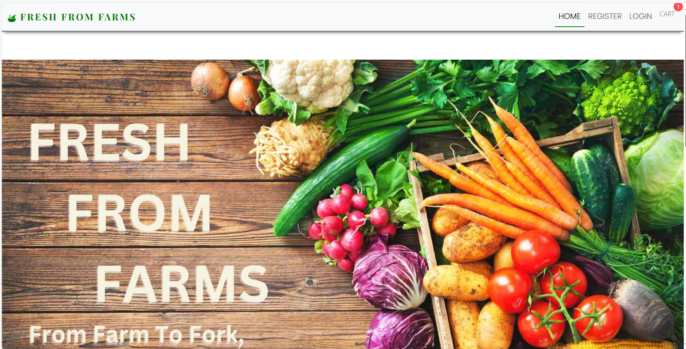
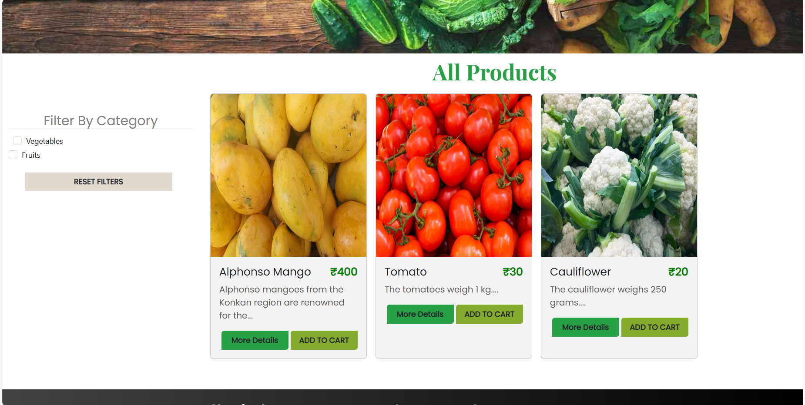
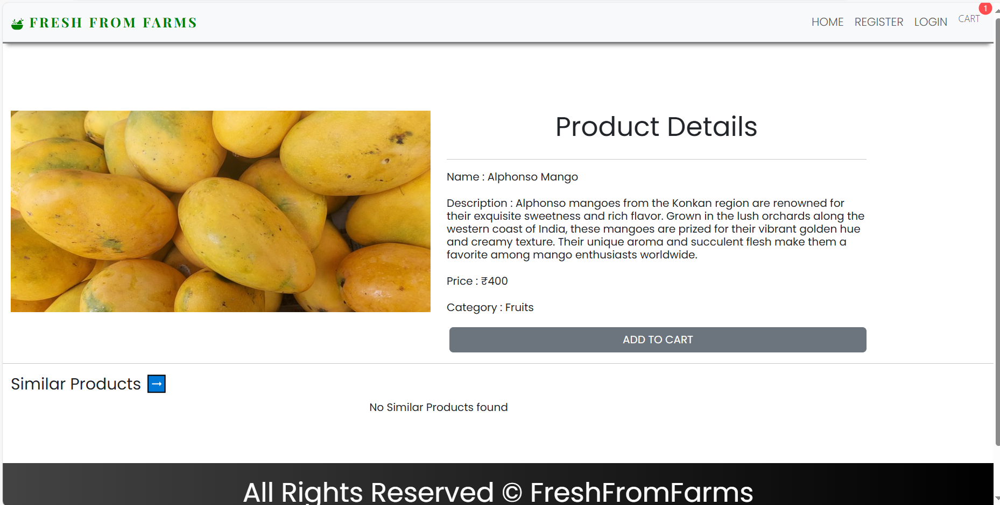
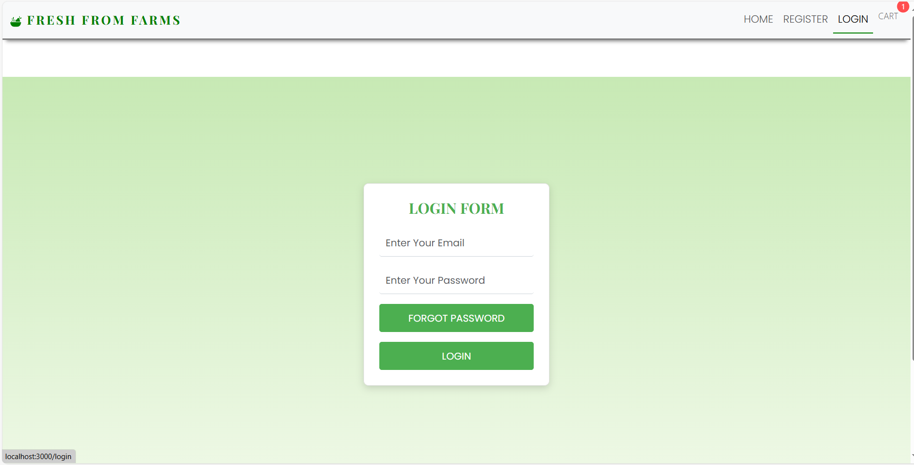
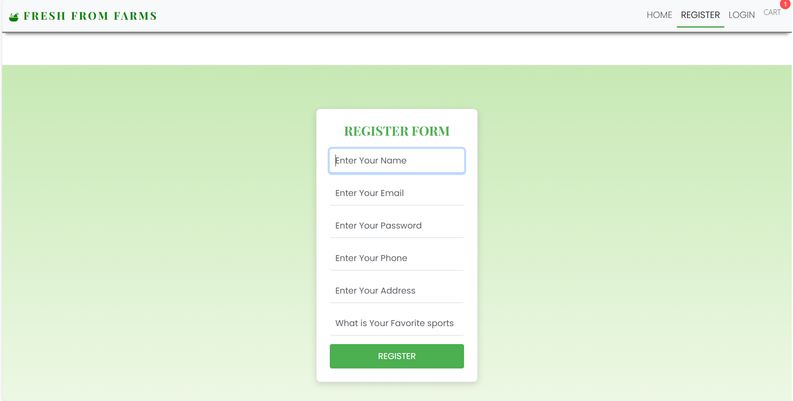
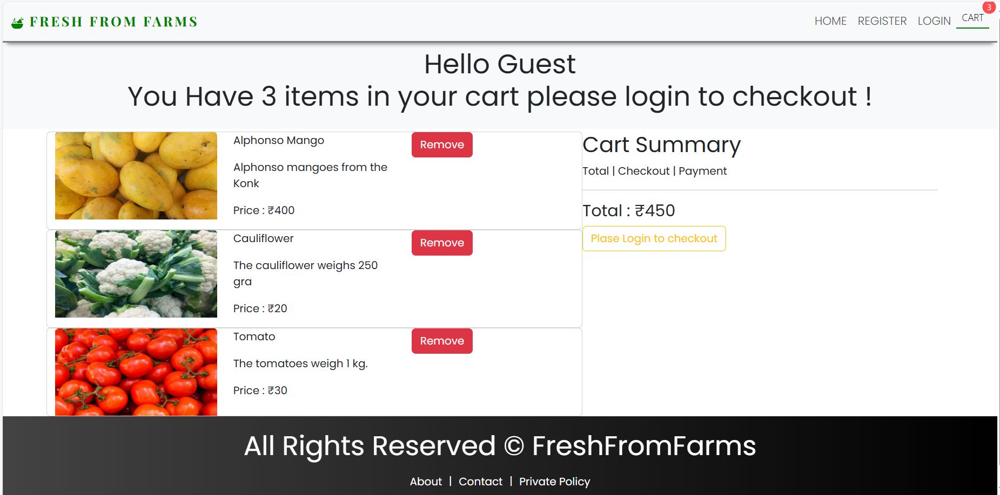
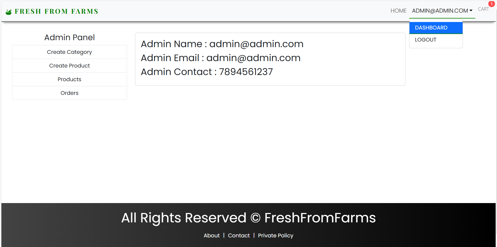
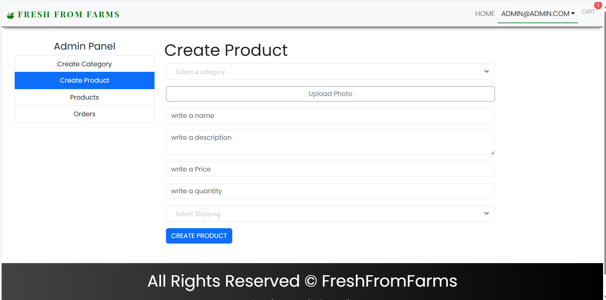

# Fresh From Farms (E-commerce App 2023)

Complete MERN stack eCommerce project 2023.

## Table of Contents

- [Features](#features)
- [Technologies Used](#technologies-used)
- [Installation](#installation)
- [Screenshots](#screenshots)

## Features

- User authentication and authorization
- Product management
- Shopping cart
- Order processing
- Admin dashboard
- Responsive design

## Technologies Used

- **Frontend:** React,
- **Backend:** Node.js, Express.js
- **Database:** MongoDB
- **Other Tools:** Bcrypt, Mongoose

## Installation

1. Clone the repository:
   ```bash
   git clone https://github.com/Manthan1128/Freshfromfarms.git
   cd ecommerce-app-2023

### Screenshot 
### Home Page

### Home Page

### Product Details Page

### Login Page

### Register Page

### Cart Page

### Admin Page

### Dashboard Page


